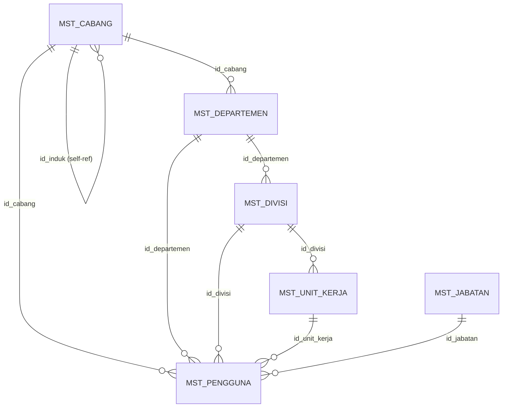

# Analisis & Implementasi Hierarki Baru Sistem Manajemen Arsip & Buku Tamu

## Latar Belakang

Setelah pull dari GitHub, terdapat **perubahan besar pada hierarki organisasi**. Sistem sebelumnya menggunakan hierarki:

```
Cabang → Divisi → Departemen → Unit Kerja
```

Migration `20260708000000_swap_organization_hierarchy.js` **membalik** relasi ini menjadi:

```
Cabang → Departemen → Divisi → Unit Kerja
```

Ditambah migration `20260711100000_add_id_induk_to_mst_cabang.js` yang menambahkan **self-referencing parent** pada `mst_cabang`, menciptakan hierarki cabang **multi-level**:

```
Pusat Jakarta (id_induk: null)
├── Pusat Surabaya (id_induk: 1)
│   ├── Cabang Madiun (id_induk: 2)
│   │   └── Unit Kecamatan Madiun (id_induk: 3)
│   ├── Cabang Mojokerto (id_induk: 2)
│   │   └── Kecamatan Mojokerto Kota (id_induk: 9)
│   └── Cabang Sidoarjo (id_induk: 2)
│       └── Kecamatan Sidoarjo Kota (id_induk: 10)
├── Pusat Bandung (id_induk: 1)
│   ├── Cabang Cimahi (id_induk: 5)
│   └── Cabang Soreang (id_induk: 5)
├── Pusat Semarang (id_induk: 1)
│   ├── Cabang Demak (id_induk: 6)
│   └── Cabang Kendal (id_induk: 6)
├── Pusat Yogyakarta (id_induk: 1)
│   ├── Cabang Bantul (id_induk: 7)
│   └── Cabang Sleman (id_induk: 7)
└── Pusat Bali (id_induk: 1)
    ├── Cabang Denpasar (id_induk: 8)
    └── Cabang Gianyar (id_induk: 8)
```

---

## Hierarki Baru — Penjelasan Lengkap

### Struktur Database (Setelah Semua Migration Dijalankan)



### Alur Hierarki Baru

| Level | Tabel | Relasi Parent | Keterangan |
|-------|-------|--------------|------------|
| **1** | `mst_cabang` | `id_induk → mst_cabang.id_cabang` (self-ref, nullable) | Root cabang = `id_induk: null` |
| **2** | `mst_departemen` | `id_cabang → mst_cabang.id_cabang` | Departemen milik cabang |
| **3** | `mst_divisi` | `id_departemen → mst_departemen.id_departemen` | Divisi milik departemen |
| **4** | `mst_unit_kerja` | `id_divisi → mst_divisi.id_divisi` | Unit kerja milik divisi |

### Perubahan dari Hierarki Lama

| Aspek | Hierarki Lama | Hierarki Baru |
|-------|--------------|---------------|
| **Level 2** | `mst_divisi.id_cabang` → cabang | `mst_departemen.id_cabang` → cabang |
| **Level 3** | `mst_departemen.id_divisi` → divisi | `mst_divisi.id_departemen` → departemen |
| **Level 4** | `mst_unit_kerja.id_departemen` → departemen | `mst_unit_kerja.id_divisi` → divisi |
| **Cabang Tree** | Flat (tidak ada parent) | Self-referencing (`id_induk`) |

### Bagaimana Multi-Tenancy Bekerja Dengan Hierarki Baru

1. **SUPERADMIN** (`kode_peran: SUPERADMIN/SA`): Melihat seluruh data tanpa batasan. Bisa menggunakan filter `X-Filter-Cabang` via header.
2. **Admin Daerah**: Hanya melihat data cabangnya sendiri **+ 1 level anak cabang langsung** (via [validate_header.js](file:///d:/COOLYEAGHH/MAGANG%20MARSHTECH/Project/Sistem-manajemen-arsip-dan-buku-tamu/express_arsip_be/middleware/validate_header.js#L168-L214)).
3. **MinIO Storage**: File disimpan dengan prefix hierarki cabang otomatis, contoh: `BR-001/BR-002/BR-003/photos/20260714/...` (via [minio_helper.js](file:///d:/COOLYEAGHH/MAGANG%20MARSHTECH/Project/Sistem-manajemen-arsip-dan-buku-tamu/express_arsip_be/core/components/tools/minio_helper.js#L81-L107)).

---

## Permasalahan Yang Teridentifikasi

### 1. Migration Belum Dijalankan
56 migration files perlu dijalankan untuk menyiapkan database.

### 2. Seed Data Belum Dijalankan
14 seed files perlu dijalankan secara berurutan untuk mengisi data master, roles, user, dan demo organization.

### 3. Potensi Inkonsistensi pada Fitur

> [!WARNING]
> **Buku Tamu** — [visit_monitoring.js](file:///d:/COOLYEAGHH/MAGANG%20MARSHTECH/Project/Sistem-manajemen-arsip-dan-buku-tamu/express_arsip_be/routes/v1/buku_tamu/visit_monitoring.js) menggunakan `applyMultiTenantFilter` yang join ke `mst_pengguna.id_user`, tapi `trs_kunjungan` tidak memiliki kolom `id_user` yang konsisten — perlu dicek apakah kolom ini sudah di-rename.

> [!WARNING]
> **Arsip Dokumen** — [document_get.js](file:///d:/COOLYEAGHH/MAGANG%20MARSHTECH/Project/Sistem-manajemen-arsip-dan-buku-tamu/express_arsip_be/routes/v1/arsip_dokumen/document_get.js) **belum menerapkan filter multi-tenancy** berdasarkan cabang. Semua user bisa melihat semua dokumen tanpa batasan hierarki.

> [!WARNING]
> **Surat Masuk** — [incoming_letter_data.js](file:///d:/COOLYEAGHH/MAGANG%20MARSHTECH/Project/Sistem-manajemen-arsip-dan-buku-tamu/express_arsip_be/routes/v1/correspondence/incoming_letter_data.js) juga **belum menerapkan filter multi-tenancy**. Semua surat masuk ditampilkan tanpa filter cabang.

> [!IMPORTANT]
> **filterHelper.js** — [filterHelper.js](file:///d:/COOLYEAGHH/MAGANG%20MARSHTECH/Project/Sistem-manajemen-arsip-dan-buku-tamu/express_arsip_be/routes/v1/components/tools/filterHelper.js) masih memakai filter strict pada `id_departemen`, `id_divisi`, dan `id_unit_kerja` untuk non-SUPERADMIN. Dengan hierarki baru, Admin Daerah seharusnya **cukup difilter berdasarkan cabang saja** (karena hierarki sudah di-handle via `x-filter-cabang` di middleware).

---

## User Review Required

> [!IMPORTANT]
> **Strategi Database**: Apakah Anda ingin saya melakukan **fresh migration** (drop semua tabel lalu create ulang) atau **incremental migration** (jalankan migration yang belum running saja)? Fresh migration lebih aman tapi menghapus data yang ada.

> [!IMPORTANT]
> **Multi-tenancy pada Arsip & Surat**: Fitur `document_get.js` dan `incoming_letter_data.js` saat ini **tidak memfilter data berdasarkan hierarki cabang**. Apakah Anda ingin saya menambahkan filter multi-tenancy pada fitur-fitur ini agar konsisten dengan hierarki baru?

---

## Open Questions

> [!IMPORTANT]
> 1. **Database sudah ada atau perlu dibuat baru?** — Apakah database `db_magang` sudah tersedia di MySQL local, atau perlu saya buat?
> 2. **MinIO server aktif?** — Beberapa fitur (upload foto, dokumen) membutuhkan MinIO yang berjalan. Apakah MinIO sudah running di `127.0.0.1:9000`?
> 3. **Seed mana yang harus dijalankan?** — Ada 14 seed files termasuk `99_full_demo_data.js` yang sangat komprehensif. Apakah cukup jalankan `99_full_demo_data.js` saja (sudah mencakup semua master data + demo), atau jalankan semua seed secara sequential?

---

## Proposed Changes

### Phase 1: Database Setup

#### Menjalankan Migration

```bash
cd express_arsip_be
npx knex migrate:latest
```

Ini akan menjalankan 56 migration files secara berurutan, termasuk:
- Pembuatan tabel awal (users, cabang, divisi, departemen, dll)
- Rename field dari English ke Indonesia
- **Swap hierarki organisasi** (migration `20260708000000`)
- **Fix foreign keys** (migration `20260710021600`)
- **Tambah `id_induk` ke mst_cabang** (migration `20260711100000`)
- Pembuatan tabel surat keluar

#### Menjalankan Seeder

```bash
npx knex seed:run
```

Urutan eksekusi seed:
1. `01_master_data.js` — Reset & isi cabang, departemen, divisi, jabatan, unit kerja
2. `02_navigation_roles.js` — Menu navigasi per role
3. `03_mst_roles.js` — Role (SUPERADMIN, ADM, PMN, SKR, STF_ARS, STF_UMM, RSP, AUD)
4. `04_superadmin_user.js` — User superadmin@admin.com / Superadmin321!
5. `06_seed_menu.js` — Menu definitions
6. `07_seed_buku_tamu.js` — Data tujuan kunjungan
7. `08_seed_arsip_dokumen.js` — Data master arsip (klasifikasi, jenis, kategori, tingkat kerahasiaan)
8. `10_demo_organization.js` — **Demo organisasi multi-cabang** (28 cabang, users, roles)
9. `10_seed_surat_keluar_menu.js` — Menu surat keluar
10. `99_full_demo_data.js` — Full demo data (dokumen, surat masuk, disposisi, kunjungan)

---

### Phase 2: Verifikasi Fitur Terhadap Hierarki

#### Fitur yang akan dites:

| Fitur | File Utama | Cek Hierarki |
|-------|-----------|--------------|
| **Buku Tamu Check-in** | [visit_checkin.js](file:///d:/COOLYEAGHH/MAGANG%20MARSHTECH/Project/Sistem-manajemen-arsip-dan-buku-tamu/express_arsip_be/routes/v1/buku_tamu/visit_checkin.js) | ✅ Sudah menggunakan `getMinioPrefix` berdasarkan `id_cabang` host |
| **Buku Tamu Data** | [visit_data.js](file:///d:/COOLYEAGHH/MAGANG%20MARSHTECH/Project/Sistem-manajemen-arsip-dan-buku-tamu/express_arsip_be/routes/v1/buku_tamu/visit_data.js) | ⚠️ Belum ada filter cabang |
| **Buku Tamu Monitoring** | [visit_monitoring.js](file:///d:/COOLYEAGHH/MAGANG%20MARSHTECH/Project/Sistem-manajemen-arsip-dan-buku-tamu/express_arsip_be/routes/v1/buku_tamu/visit_monitoring.js) | ✅ Menggunakan `applyMultiTenantFilter` |
| **Arsip Dokumen** | [document_get.js](file:///d:/COOLYEAGHH/MAGANG%20MARSHTECH/Project/Sistem-manajemen-arsip-dan-buku-tamu/express_arsip_be/routes/v1/arsip_dokumen/document_get.js) | ❌ Tidak ada filter hierarki |
| **Surat Masuk Data** | [incoming_letter_data.js](file:///d:/COOLYEAGHH/MAGANG%20MARSHTECH/Project/Sistem-manajemen-arsip-dan-buku-tamu/express_arsip_be/routes/v1/correspondence/incoming_letter_data.js) | ❌ Tidak ada filter hierarki |
| **Disposisi Surat** | [letter_disposition_create.js](file:///d:/COOLYEAGHH/MAGANG%20MARSHTECH/Project/Sistem-manajemen-arsip-dan-buku-tamu/express_arsip_be/routes/v1/correspondence/letter_disposition_create.js) | ⚠️ Bisa disposisi ke user di luar cabang |
| **MinIO Prefix** | [minio_helper.js](file:///d:/COOLYEAGHH/MAGANG%20MARSHTECH/Project/Sistem-manajemen-arsip-dan-buku-tamu/express_arsip_be/core/components/tools/minio_helper.js) | ✅ Sudah traverse `id_induk` untuk prefix path |
| **Multi-tenant Filter** | [filterHelper.js](file:///d:/COOLYEAGHH/MAGANG%20MARSHTECH/Project/Sistem-manajemen-arsip-dan-buku-tamu/express_arsip_be/routes/v1/components/tools/filterHelper.js) | ⚠️ Non-SA filter terlalu strict (dept+div+unit) |
| **Auth Middleware** | [validate_header.js](file:///d:/COOLYEAGHH/MAGANG%20MARSHTECH/Project/Sistem-manajemen-arsip-dan-buku-tamu/express_arsip_be/middleware/validate_header.js) | ✅ Sudah handle hierarki cabang + expand 1 level |
| **Branch API** | [branch_get.js](file:///d:/COOLYEAGHH/MAGANG%20MARSHTECH/Project/Sistem-manajemen-arsip-dan-buku-tamu/express_arsip_be/routes/v1/master/organisasi/branches/branch_get.js) | ✅ Sudah join `id_induk` dan filter via header |

---

### Phase 3: Testing via API Calls

Setelah migration dan seed berhasil, saya akan menjalankan backend dan melakukan testing API:

1. **Login sebagai SUPERADMIN** → Verifikasi token/session
2. **GET Branches** → Verifikasi hierarki cabang (parent-child) muncul benar
3. **GET Departments** → Verifikasi filter berdasarkan cabang
4. **GET Divisi** → Verifikasi filter berdasarkan departemen
5. **POST Visit Check-in** → Verifikasi MinIO prefix sesuai hierarki
6. **POST Visit Data** → Verifikasi data kunjungan
7. **POST Incoming Letter Data** → Verifikasi surat masuk
8. **POST Document Get** → Verifikasi dokumen arsip

---

## Verification Plan

### Automated Tests
```bash
# 1. Jalankan migration
cd express_arsip_be && npx knex migrate:latest

# 2. Jalankan seeder
npx knex seed:run

# 3. Start backend server
npm run dev

# 4. Test API endpoints via curl/Postman
```

### Manual Verification
- Verifikasi struktur tabel di MySQL setelah migration (cek FK, kolom baru)
- Verifikasi data seeder masuk dengan benar (cabang, departemen, divisi, user)
- Test API endpoints dengan header `X-UniqueId` untuk bypass auth (mode debug)
- Verifikasi filter multi-tenancy bekerja sesuai role (SUPERADMIN vs Admin Daerah)
